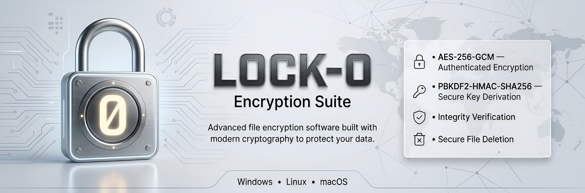

<p align="center">
    
</p>

# LOCK-0

Modern, secure, and lightweight file encryption software written in Python.

LOCK-0 is a desktop application designed to securely encrypt and decrypt files using modern cryptographic standards. It combines a simple graphical interface with authenticated encryption to protect your data while remaining easy to use.

---

## Features

- AES-256-GCM authenticated encryption
- PBKDF2-HMAC-SHA256 key derivation
- 600,000 PBKDF2 iterations
- Secure deletion of original files
- Automatic file integrity verification
- Folder-based encryption
- Modern CustomTkinter interface
- Cross-platform support
- Random salt and nonce generation
- SHA-256 integrity validation

---

## Security

LOCK-0 follows modern cryptographic best practices.

| Component | Specification |
|------------|---------------|
| Encryption Algorithm | AES-256-GCM |
| Key Derivation | PBKDF2-HMAC-SHA256 |
| PBKDF2 Iterations | 600,000 |
| Key Size | 256-bit |
| Salt | 16 bytes |
| Nonce | 12 bytes |
| Integrity | GCM Authentication Tag |
| Hash Function | SHA-256 |

---

## Encryption Workflow

```text
Password
    │
    ▼
PBKDF2-HMAC-SHA256
(600,000 iterations)
    │
    ▼
256-bit Encryption Key
    │
    ▼
AES-256-GCM
    │
    ▼
Encrypted File
```

---

## Encrypted File Structure

```text
┌────────────────────────────┐
│ Magic Header               │
├────────────────────────────┤
│ Version                    │
├────────────────────────────┤
│ Original File Size         │
├────────────────────────────┤
│ Random Salt (16 bytes)     │
├────────────────────────────┤
│ Random Nonce (12 bytes)    │
├────────────────────────────┤
│ Ciphertext                 │
├────────────────────────────┤
│ Authentication Tag         │
└────────────────────────────┘
```

---

## Requirements

- Python 3.8 or newer
- Windows, Linux or macOS

Required packages:

```bash
cryptography
customtkinter
Pillow
```

Install everything with:

```bash
pip install -r requirements.txt
```

---

## Installation

Clone the repository:

```bash
git clone https://github.com/BassemMohamed44/LOCK-0.git

cd LOCK-0
```

Install dependencies:

```bash
pip install -r requirements.txt
```

Run the application:

```bash
python LOCK-0.py
```

---

## Building an Executable

Using PyInstaller:

```bash
pip install pyinstaller

pyinstaller ^
    --onefile ^
    --windowed ^
    --icon=L0.ico ^
    LOCK-0.py
```

---

## Usage

### Encrypt Files

1. Launch LOCK-0.
2. Select the folder to encrypt.
3. Enter a strong password.
4. Choose **Encrypt**.
5. Click **Start**.

The original files will be securely deleted after successful encryption.

---

### Decrypt Files

1. Launch LOCK-0.
2. Select the folder containing encrypted files.
3. Enter the correct password.
4. Choose **Decrypt**.
5. Click **Start**.

The original files will be restored.

---

## Project Structure

```text
LOCK-0/
│
├── LOCK-0.py
├── requirements.txt
├── LICENSE
├── README.md
├── SECURITY.md
└── assets/
```

---

## Supported Platforms

| Platform | Status |
|----------|--------|
| Windows | Supported |
| Linux | Supported |
| macOS | Supported |

---

## Roadmap

- [ ] Command Line Interface
- [ ] Drag & Drop support
- [ ] Multi-threaded encryption
- [ ] Single file encryption mode
- [ ] Automatic update checker
- [ ] Dark / Light theme
- [ ] Localization
- [ ] Encryption history
- [ ] Secure password generator

---

## Contributing

Contributions are welcome.

1. Fork the repository.
2. Create a feature branch.

```bash
git checkout -b feature/my-feature
```

3. Commit your changes.

```bash
git commit -m "Add new feature"
```

4. Push the branch.

```bash
git push origin feature/my-feature
```

5. Open a Pull Request.

---

## Security Notice

LOCK-0 is designed to provide strong encryption, but security also depends on the user.

Please remember:

- Use a strong and unique password.
- Keep backups of important files.
- Never encrypt operating system files.
- There is **no password recovery mechanism**.
- Lost passwords cannot be recovered.

---

## License

This project is licensed under the MIT License.

See the [LICENSE](LICENSE) file for more information.

---

## Acknowledgments

This project relies on several excellent open-source libraries.

- cryptography
- CustomTkinter
- Pillow

Thanks to the maintainers and contributors of these projects.

---

<p align="center">

Built with Python.

If you find this project useful, consider giving it a ⭐ on GitHub.

</p>
